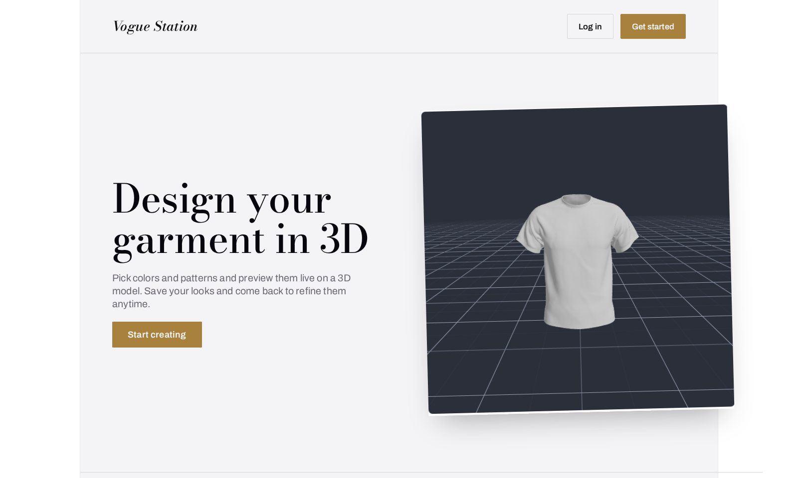
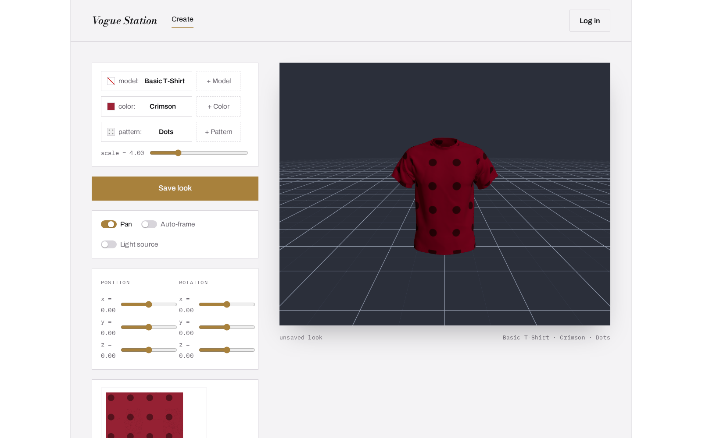

<div align="center">

# Vogue Station

**Design a garment in 3D — pick a model, a color, a pattern — save it, publish it, browse everyone else's.**

[](https://react.dev)
[](https://www.typescriptlang.org)
[](https://threejs.org)
[](https://vitejs.dev)
[](https://nestjs.com)
[](https://www.postgresql.org)

</div>

<br>



## What this is

A full-stack pet project built to practice a real product's shape, not just a
CRUD demo: a **live 3D garment editor** (three.js) backed by a real API
(NestJS + Postgres + S3-compatible storage), with accounts, a personal
cabinet, user-submitted content, and an admin moderation queue gating what
becomes public. Two repos, split like a real product would be:

- **This repo** — the React frontend (editor, auth, cabinet, gallery, admin UI).
- [**vogue-station-backend**](https://github.com/mjyt13/vogue-station-backend) — NestJS API, Prisma/Postgres, S3 storage, JWT auth, moderation.



## Features

- **Live 3D customization** — swap the garment model, color, and pattern and
  watch the preview update in place; drag to orbit, pan, auto-frame, toggle a
  visible light source, and nudge position/rotation per axis. A live UV-unwrap
  preview shows exactly how the pattern tiles across the mesh.
- **Accounts** — register/login, JWT access token + rotating httpOnly refresh
  cookie, role-based access control (user / admin).
- **Bring your own assets** — upload a custom `.glb` garment model, a color,
  or a pattern image; each gets validated, thumbnailed, and is immediately
  usable by its owner.
- **Cabinet** — every look you build is saved and can be reopened, edited,
  and re-saved (or saved as a new copy) later.
- **Publish + moderation** — submit a look (or a color/pattern/model) for
  review; an admin approves or rejects it before it goes public. A look can
  only be approved once everything it references is already public.
- **Public gallery** — browse everyone's approved looks, filterable by color
  or pattern.

## Tech stack

|            | Frontend                                                                                          | Backend                                                                                     |
| ---------- | -------------------------------------------------------------------------------------------------- | ----------------------------------------------------------------------------------------------- |
| Core       | React 19, TypeScript, Vite (React Compiler)                                                        | NestJS 11, TypeScript                                                                            |
| 3D         | three.js, `@react-three/fiber`, `@react-three/drei`                                                 | —                                                                                                 |
| Data       | TanStack Query, `openapi-fetch` (typed from the backend's OpenAPI spec)                             | Prisma 7 + Postgres (via `@prisma/adapter-pg`)                                                    |
| Forms/UI   | React Hook Form + Zod, Radix UI (Dialog/Tabs/Dropdown)                                              | class-validator / class-transformer                                                              |
| Auth       | in-memory access token, `credentials: include` for the refresh cookie                              | `@nestjs/jwt`, argon2 password hashing                                                            |
| Storage    | —                                                                                                    | S3-compatible object storage (MinIO locally) via `@aws-sdk/client-s3` + presigned URLs, `sharp` for thumbnails |
| Routing    | React Router 7                                                                                       | Nest controllers, `@nestjs/throttler` rate limiting                                              |

## Architecture notes

- **Feature folders** under `src/features/<name>/`, each exporting through a
  barrel `index.ts` (a facade — import `from './features/viewer'`, never a
  file deep inside it).
- **Config-driven UI over duplication** — e.g. the 6 position/rotation
  sliders are generated from a `GROUPS × AXES` config with one `AxisSlider`
  component and one handler, not six near-copies.
- **The viewer knows nothing about the catalog.** `GarmentMaterial =
  {color, patternUrl, patternScale}` is a pure render contract; the wardrobe
  feature (colors/patterns/models) hands it one, the viewer just renders it.
- **Presigned URLs are ephemeral** (~10 min) — fetched right before use,
  never persisted, refetched on a storage 403.

## Getting started

You'll need both repos running — this one and
[`vogue-station-backend`](https://github.com/mjyt13/vogue-station-backend).

**Backend** (from the `vogue-station-backend` repo):

```bash
npm install
npm run db:up             # Postgres (docker compose; Steam Deck: db:up:deck)
npm run minio:up:deck     # MinIO (S3-compatible storage) — or any S3-compatible store
npm run db:migrate
npm run db:seed           # admin user + preset colors/patterns/catalog model
npm run storage:bootstrap # create the bucket, upload catalog assets
npm run start:dev         # → http://localhost:3000
```

**Frontend** (this repo):

```bash
npm install
cp .env.example .env   # VITE_API_URL, defaults to http://localhost:3000
npm run dev            # → http://localhost:5173
```

Other scripts:

```bash
npm run build       # tsc -b + production build
npm run lint         # eslint
npm run api:types    # regenerate the typed API client from docs/openapi.json
```

Seeded dev login: `admin@vogue.dev` / `admin-password-123`.

## Project structure

```
src/
  app/                 app shell — layout, header/nav
  features/
    auth/              login/register, session, route guards
    landing/           public marketing page
    create/            the editor route (composes viewer + wardrobe)
    viewer/            3D scene: model loading, transforms, UV preview
    wardrobe/          color/pattern/model catalog, pickers, upload dialogs
    cabinet/           a user's saved looks + patterns
    gallery/           public browse of approved looks
    admin/             moderation queues
  shared/              domain-agnostic primitives (Toggle, SwatchPicker,
                       Modal, the typed API client) and cross-feature UI
```
